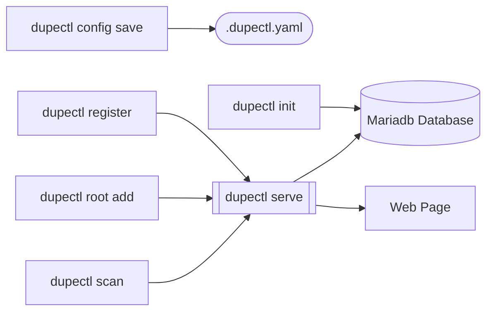

# dupectl: Duplicate File Manager

```
	 _____                    _____ _______ _      
	|  __ \                  / ____|__   __| |     
	| |  | |_   _ _ __   ___| |       | |  | |     
	| |  | | | | | '_ \ / _ \ |       | |  | |     
	| |__| | |_| | |_) |  __/ |____   | |  | |____ 
	|_____/ \__,_| .__/ \___|\_____|  |_|  |______|
                     | |                               
                     |_|                               			
```
	
### Enables searching for Duplicate Files and manage their retention.

DupeCTL is a single go binary that provides the functionality needed to:
- Scan files on a local drive (or network share) and store the following in a database:
    - File name
    - created, modified, accessed and birth dates
    - file size
    - file hash (SHA512)
- Provide an API for the scanner to request folders to scan and save results
- Provide a web page for the user to list duplicate files and visually assign: 
    - Owner (name of person owning the file)
    - Purpose (os, personal files, project files, confidential, etc)
    - Retention Policy (Disaster Recovery, Short Term Archive, Long Term Archive, etc)

DupeCTL uses MariaDB (or MySQL) to store file and folder information.

DupeCTL Requires a configuration file with database connection settings updated to match your MariaDB host/port/user/password settings.




## Config File
An initial configuration file can be created using the following command:
```
dupectl config save
```

DupeCTL will create a `.dupectl.yaml` file in the folder with the following content:
```
client:
    apihost: "localhost"
    apikey: "COPY API KEY FROM SERVER HERE"
    apiport: "3000" - CHANGE AS NEEDED - MUST MATCH server.port
    apitoken: "THIS WILL BE AUTOMATICALLY UPDATED WITH REGISTER COMMAND"
    clientid: ID OF CLIENT - WILL REMAIN THE SAME 
    uniqueid: UNIQUE ID OF CLIENT - WILL BE RANDOMLY CREATED IF THIS KEY IS DELETED 
database:
    dbname: dupedb - DO NOT CHANGE
    hostname: 127.0.0.1 - CHANGE AS NEEDED
    password: "" - CHANGE AS NEEDED
    port: "3306" - CHANGE AS NEEDED
    username: root - CHANGE AS NEEDED
server:
    apikey: API KEY TO USE BY CLIENTS - WILL BE RANDOMLY CREATED
    port: "3000" - CHANGE AS NEEDED - 
    serverid: UNIQUE ID OF SERVER - WILL REMAIN THE SAME
```

Edit your `.dupectl.yaml` file on the server side with database connection and server port settings. 

Edit your `.dupectl.yaml` file on the client side with client settings. 
1. Copy the apikey from the server to the apikey of the client section
2. Copy the port from the server to the apiport of the client section
3. Enter the hostname of the server to the apihost of the client section  
